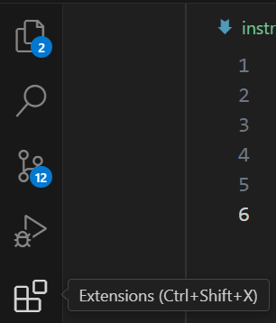
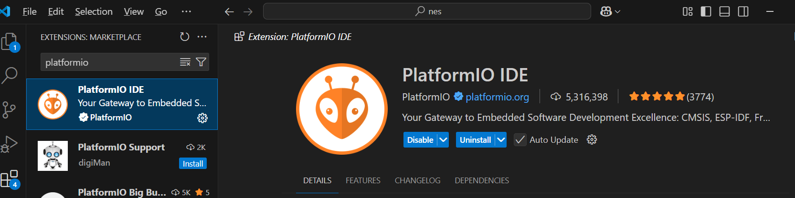
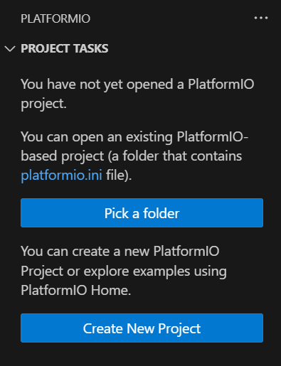
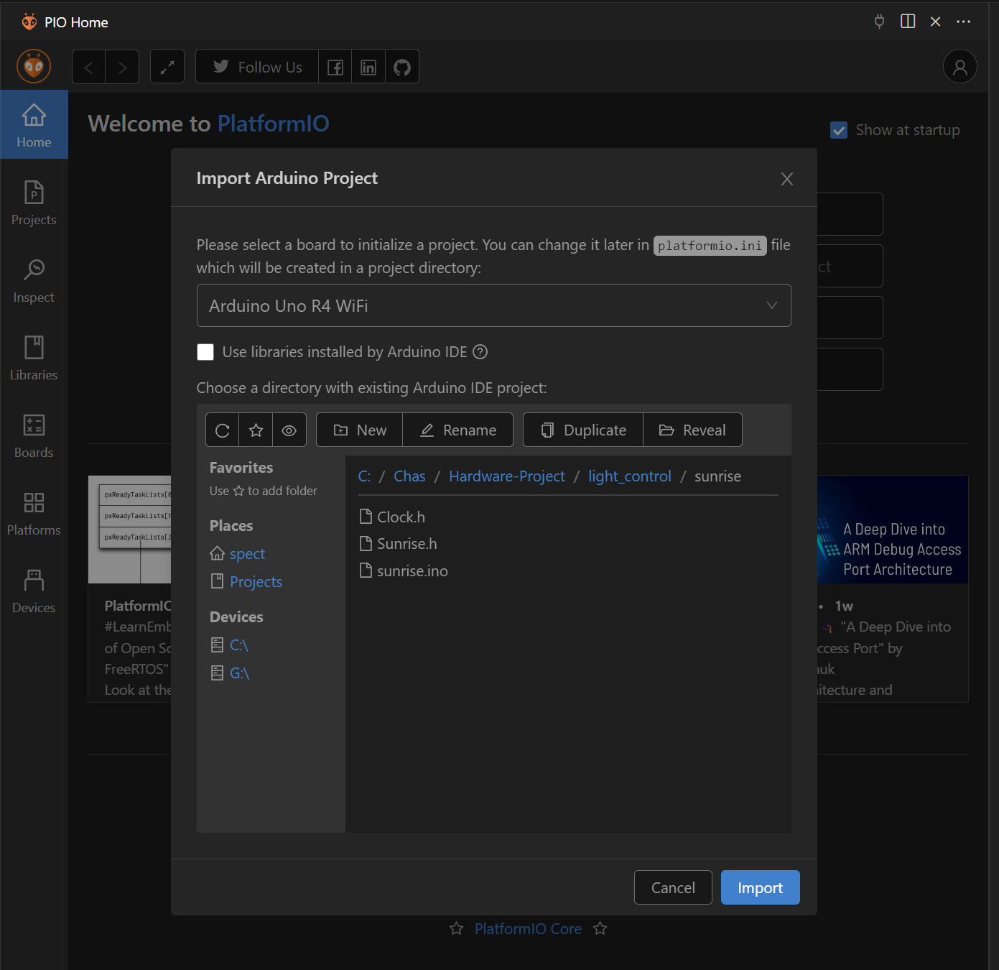
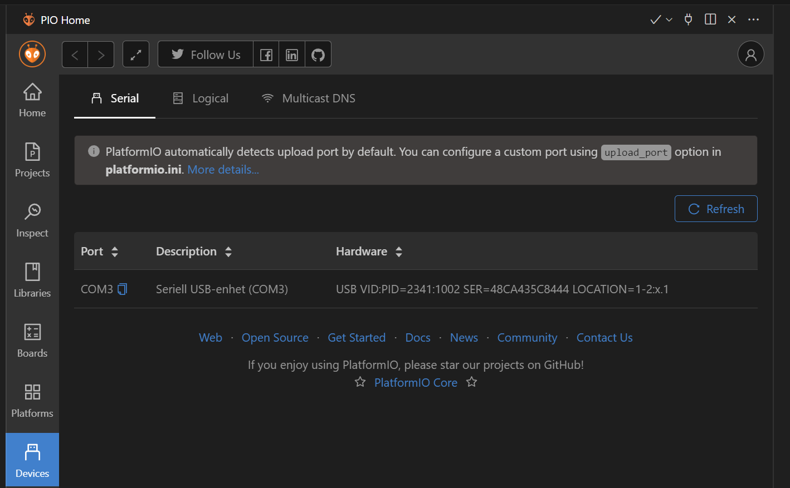
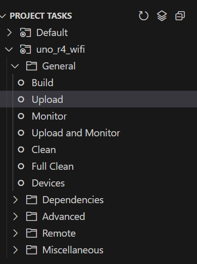

# Installera PlatformIO

## För VSCode

1. Om du inte redan har VScode installerat, ladda ner programmet här: 

2. Öppna Extensions-menyn med knappen på sidolisten: 

3. Hitta upp PlatformIO-pluginen med sökfunktionen. Säkerställ att det är rätt plugin genom att kolla att antalet nedladdningar och betyg är högt. 

4. Efter att installationen gått klart ska det finnas en ny knapp på sidolisten. Tryck på den för att skapa ett nytt projekt. 
 

5. I huvudfönstret kan du nu välja att importera ett existerande Arduino-projekt. Välj vilken plattform du utvecklar på (i mitt fall Arduino R4 Wifi). Navigera till mappen där din projektfil ligger, och välj OK. 

6. Koppla in Arduinon. Se till att den upptäcks i listan under Devices. Du kan behöva trycka på refresh i listan för att den ska dyka upp. 

6. I fönstret till vänster kan du välja Upload för att bränna programmet till Arduinon. 
